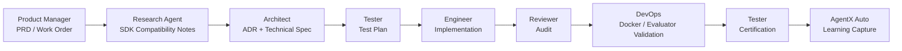
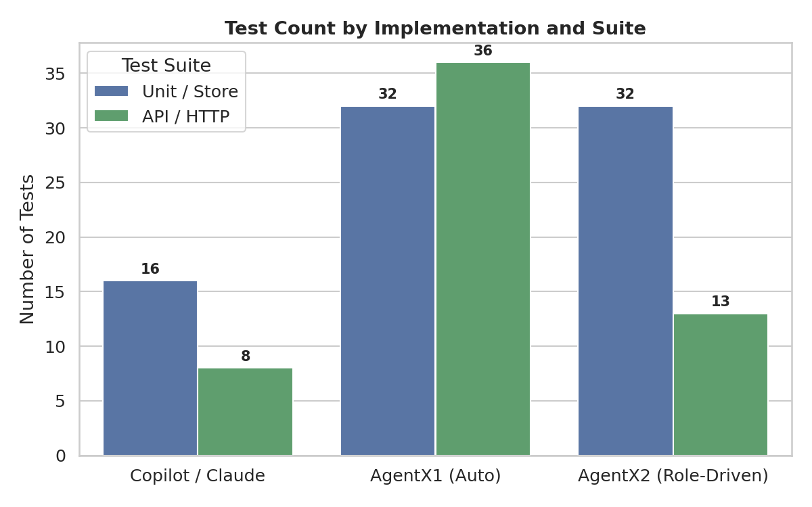
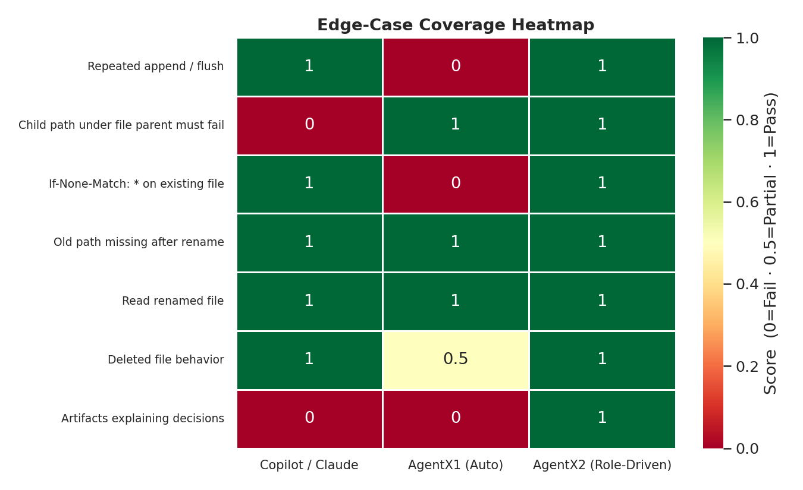
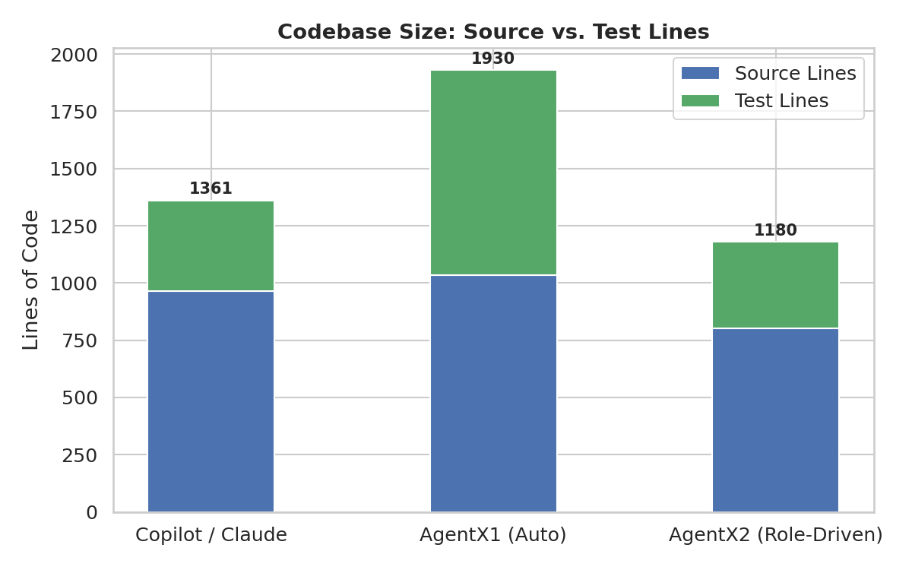
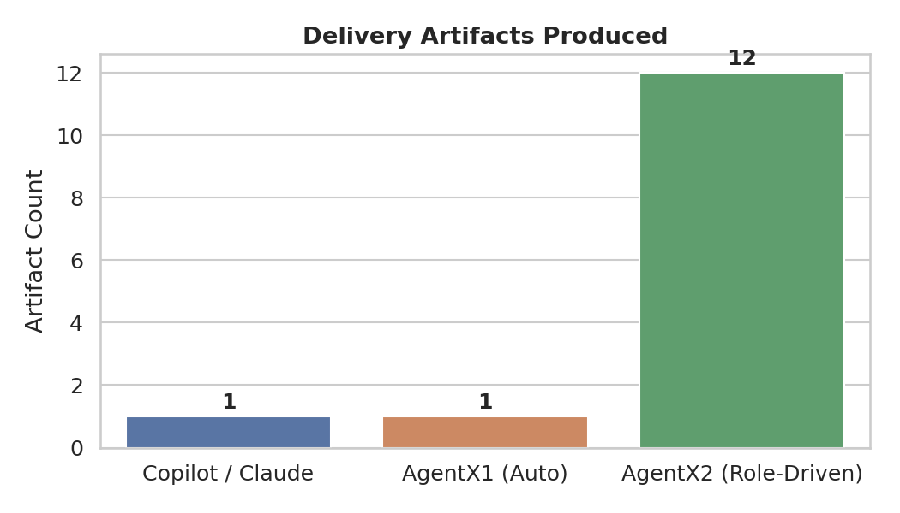
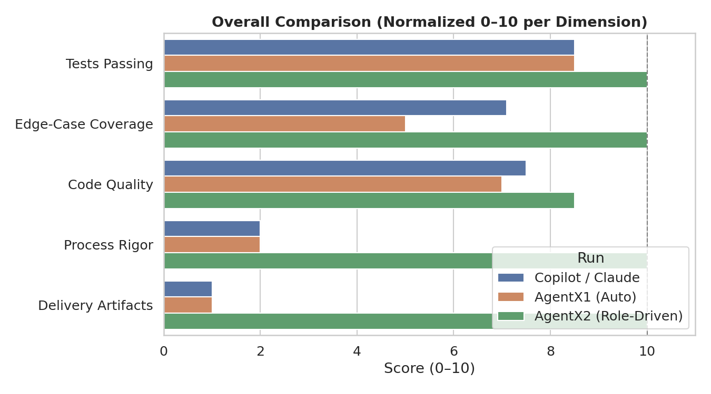
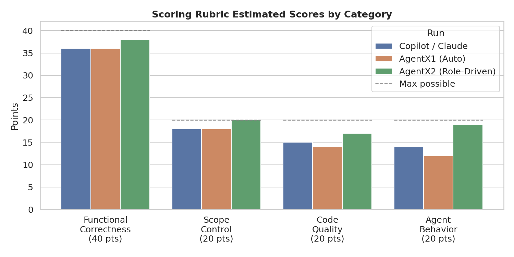

# AgentX Evaluation: Coding Agent vs Delivery Orchestrator

This repository documents a practical evaluation of **AgentX** against a standard coding-agent workflow using **Copilot / Claude** as the baseline.

The goal was not to build a production-grade Azure Storage emulator. The emulator was only the benchmark task. The real question was:

> Does AgentX add useful capability beyond a strong coding agent, or is it mostly extra process overhead?

The short answer from this evaluation:

> **AgentX did not clearly outperform Copilot / Claude when used as a normal coding agent. Its value appeared only when we forced AgentX into a structured, role-driven delivery workflow.**

A presentation summarizing the evaluation is included in the repo as `agentx_copilot_comparison.pdf`. The deck frames the central conclusion as: **Copilot / Claude remains a strong fast-coding baseline; AgentX Auto alone was not differentiated; AgentX role workflow is worth a targeted pilot where planning, review, certification, and learning capture matter.** :contentReference[oaicite:0]{index=0}

---

## Background

Many people already use modern coding agents such as GitHub Copilot, Claude Code, Codex, and related tools. AgentX advertises a different value proposition: not only code generation, but structured multi-agent software delivery inside the IDE.

AgentX includes role-specific agents such as:

- Product Manager
- Consulting Research
- Architect
- Engineer
- Tester
- Reviewer
- DevOps
- Auto-Fix Reviewer
- AgentX Auto

The hypothesis was that AgentX might provide additional value through:

- explicit planning artifacts
- role separation
- research before implementation
- architecture decision records
- test planning
- review gates
- certification evidence
- learning capture
- more reproducible delivery workflows

The initial concern was that AgentX might simply burn more tokens and time while producing results similar to a normal coding agent. This evaluation was designed to test that.

---

## Benchmark Task

We used a greenfield implementation task:

> Build a Dockerized local emulator for a practical subset of Azure Data Lake Storage Gen2 that can be driven by the real `azure-storage-file-datalake` Python SDK.

The benchmark project was called:

```text
ADLS Gen2 Lite Emulator
````

The emulator had to support a practical SDK lifecycle:

1. Create filesystem
2. Create directory
3. Create file
4. Append bytes
5. Flush bytes
6. Download/read file
7. List paths
8. Rename file
9. Delete file
10. Delete filesystem

The emulator was intentionally scoped as a **local ADLS Gen2-compatible subset for integration tests**, not a full Azure Storage replacement.

---

## Acceptance Criteria

Each implementation had to pass the same deterministic gate:

```bash
pytest -q
docker compose up
curl http://127.0.0.1:10004/health
python examples/python_sdk_smoke.py
./scripts/evaluate.sh
```

The acceptance criteria were:

* `docker compose up` starts the emulator on port `10004`
* `/health` returns `OK`
* `pytest -q` passes
* `scripts/evaluate.sh` passes
* `examples/python_sdk_smoke.py` uses the real Azure SDK against the local emulator
* no live Azure resource is used

The core evaluator was `scripts/evaluate.sh`, which ran:

```text
[1/5] Running unit/API tests
[2/5] Building Docker image
[3/5] Starting emulator
[4/5] Waiting for health endpoint
[5/5] Running Azure SDK smoke test
```

---

## Runs Compared

We compared three runs.

| Run                       | How it was used                             | Result                                                                        |
| ------------------------- | ------------------------------------------- | ----------------------------------------------------------------------------- |
| `Copilot / Claude 4.7 1M` | Standard coding-agent workflow              | Passed evaluator; strong SDK debugging; minimal process artifacts             |
| `AgentX1`                 | AgentX Auto used like a normal coding agent | Passed evaluator, but did not demonstrate differentiated orchestration value  |
| `AgentX2`                 | Forced role-driven AgentX workflow          | Passed evaluator; produced delivery artifacts; strongest hidden-edge coverage |

The key comparison is **AgentX1 vs AgentX2**.

They used the same tool, but different operating models:

* AgentX1: “Use AgentX Auto like a coding agent.”
* AgentX2: “Force each AgentX role to produce its part of the delivery workflow.”

---

## Methodology

### 1. Define the same task for each agent

Each run received the same high-level task and acceptance criteria.

The common task contract included:

* build an ADLS Gen2 Lite Emulator
* run in Docker
* expose `/health`
* support real Azure SDK smoke test
* require no live Azure resources
* preserve the evaluator

### 2. Run baseline coding-agent workflow

The Copilot / Claude run was allowed to work like a normal coding agent:

```text
read files → write code → debug → run tests → iterate until pass
```

### 3. Run AgentX Auto as a coding agent

The first AgentX run used AgentX Auto in a similar way.

This tested whether AgentX Auto would automatically produce an obviously better delivery process.

It did not.

### 4. Run AgentX as a forced role-driven workflow

For AgentX2, we explicitly required role artifacts before and after implementation.

The workflow was:

1. Product Manager creates PRD / work order
2. Research agent creates SDK compatibility notes
3. Architect creates ADR and technical spec
4. Tester creates test plan
5. Engineer implements
6. Reviewer audits the implementation
7. DevOps validates Docker/evaluator workflow
8. Tester certifies final behavior
9. AgentX Auto captures learning and delivery summary

This was designed to test AgentX’s advertised value as a multi-agent delivery workflow, rather than as another coding model.

---

## AgentX2 Role Workflow

AgentX2 used a structured, role-driven delivery process rather than a simple code-and-iterate loop.



---

## AgentX2 Required Artifacts

AgentX2 produced the following delivery artifacts:

```text
docs/agentx/WORK-ORDER-adls-gen2-lite-emulator.md
docs/product/PRD-adls-gen2-lite-emulator.md
docs/research/ADLS-GEN2-SDK-COMPATIBILITY-NOTES.md
docs/architecture/ADR-adls-gen2-lite-emulator.md
docs/architecture/SPEC-adls-gen2-lite-emulator.md
docs/testing/TEST-PLAN-adls-gen2-lite-emulator.md
docs/reviews/REVIEW-adls-gen2-lite-emulator.md
docs/devops/DEVOPS-VALIDATION-adls-gen2-lite-emulator.md
docs/testing/CERTIFICATION-adls-gen2-lite-emulator.md
docs/execution/DELIVERY-SUMMARY-adls-gen2-lite-emulator.md
docs/artifacts/learnings/LEARNING-adls-gen2-lite-emulator.md
```

This artifact trail is the main thing that differentiated AgentX2 from both Copilot / Claude and AgentX1.

---

## Baseline Results

All three runs produced working code.

| Metric               |    Copilot / Claude |            AgentX1 |                                  AgentX2 |
| -------------------- | ------------------: | -----------------: | ---------------------------------------: |
| `evaluate.sh`        |                PASS |               PASS |                                     PASS |
| Unit/API tests       |           23 passed |          25 passed | 68 passed, 1 skipped in local inspection |
| Docker startup       |                PASS |               PASS |                                     PASS |
| Azure SDK smoke      | PASS, with warnings | PASS, clean output |               PASS in delivered evidence |
| Process artifacts    |             Minimal |            Minimal |                                   Strong |
| Hidden-edge behavior |               Mixed |              Mixed |                                     Best |



Pass/fail alone was not enough to distinguish value. All three could build the basic project.

The differences emerged in:

* hidden edge cases
* SDK protocol semantics
* review/certification artifacts
* traceability of decisions
* role-driven process output

---

## Hidden Edge Case Results

We also compared behavior on edge cases that were not the primary acceptance gate.

| Edge Case                              | Copilot / Claude | AgentX1 | AgentX2 |
| -------------------------------------- | ---------------: | ------: | ------: |
| Repeated append / flush                |             Pass |    Fail |    Pass |
| Child path under file parent must fail |             Fail |    Pass |    Pass |
| `If-None-Match: *` on existing file    |             Pass |    Fail |    Pass |
| Old path missing after rename          |             Pass |    Pass |    Pass |
| Read renamed file                      |             Pass |    Pass |    Pass |
| Deleted file behavior                  |             Pass |   Basic |    Pass |
| Artifacts explaining decisions         |               No |      No |     Yes |

AgentX2 had the strongest combination of edge-case behavior and delivery traceability.

> **Edge-case scoring key:** Pass = 1 pt · Basic/Partial = 0.5 pt · Fail = 0 pt · Artifact present = 1 pt · Artifact absent = 0 pt  
> Maximum possible score = 7 pts (6 technical edge-case dimensions + 1 delivery-artifact dimension)



---

## Copilot / Claude Baseline

The Copilot / Claude result was strong.

It produced:

* a working emulator
* passing tests
* Docker support
* a real Azure SDK smoke test
* meaningful SDK debugging
* inspection of Azure SDK internals during troubleshooting

Weaknesses:

* minimal process artifacts
* SDK decode warnings in output
* at least one missed hierarchical namespace edge case
* repo hygiene issues in delivered zip

The baseline showed that Copilot / Claude is already very capable for implementation-heavy tasks.

---

## AgentX1 Result

AgentX1 also produced a working implementation.

It passed:

* unit/API tests
* Docker startup
* `/health`
* Azure SDK smoke test

However, AgentX1 behaved like a standard coding agent:

```text
read files → write code → debug → validate
```

It did **not** produce meaningful delivery artifacts such as:

* PRD
* ADR
* review report
* certification report
* learning capture

Conclusion:

> AgentX Auto alone did not demonstrate clear value over a standard coding agent.

---

## AgentX2 Result

AgentX2 was the strongest result because it used AgentX as a role-driven workflow rather than as a coding agent.

It produced:

* product requirements
* SDK compatibility research
* architecture decisions
* technical spec
* test plan
* implementation
* review
* DevOps validation
* certification
* learning capture

This was the first run that demonstrated AgentX’s intended differentiator.

The improvement came from:

```text
process structure + role separation + review/certification + learning capture
```

not from obviously superior raw code generation.

---

## Key Findings

### 1. AgentX is not a better Copilot by default

When AgentX was used as a drop-in coding agent, it did not clearly outperform Copilot / Claude.

### 2. AgentX Auto mode alone was not compelling

AgentX1 passed the evaluator, but it did not produce the advertised orchestration artifacts.

### 3. AgentX role workflow produced differentiated value

AgentX2 produced a stronger delivery trail and better hidden-edge coverage.

### 4. The value is workflow, not raw codegen

AgentX’s credible value proposition is:

* planning
* research
* architecture
* test planning
* review
* certification
* learning capture

not faster implementation on simple coding tasks.

### 5. AgentX requires operator discipline

The role-driven result was better, but it required forcing the workflow. That is more ceremony than a standard coding-agent loop.





---

## Recommendation

Use Copilot / Claude for fast coding.

Use AgentX selectively where the work benefits from structured delivery.

Good candidates for AgentX:

* platform components
* emulators / SDK compatibility projects
* infrastructure automation
* architecture-heavy features
* multi-artifact deliveries
* work requiring review or certification evidence
* regulated or multi-team engineering workflows

Poor candidates for AgentX:

* small one-file fixes
* simple refactors
* exploratory coding
* work where Copilot already performs well
* tasks where speed matters more than traceability

---

## Recommended AgentX Operating Model

If using AgentX, do not rely on AgentX Auto alone.

Use the full role workflow:

```text
1. PRD
2. Research
3. ADR / spec
4. Test plan
5. Implement
6. Review
7. DevOps validation
8. Certification
9. Learning capture
```

This is the mode that produced a differentiated result.

---

## How to Reproduce the Evaluation

### Run the evaluator

From any implementation directory:

```bash
./scripts/evaluate.sh
```

Expected stages:

```text
[1/5] Running unit/API tests
[2/5] Building Docker image
[3/5] Starting emulator
[4/5] Waiting for health endpoint
[5/5] Running Azure SDK smoke test
PASS
```

### Run manually

```bash
docker compose up --build -d
curl -fsS http://127.0.0.1:10004/health
python examples/python_sdk_smoke.py
docker compose down -v
```

### Run tests only

```bash
pytest -q
```

---

## Demo Commands

Example demo flow:

```bash
cd <implementation-directory>

docker compose up --build -d

curl -fsS http://127.0.0.1:10004/health

python examples/python_sdk_smoke.py

./scripts/evaluate.sh

docker compose down -v
```

---

## Suggested Repository Layout

This repo can be organized as:

```text
.
├── README.md
├── presentation/
│   └── agentx_copilot_comparison.pdf
├── prompts/
│   ├── design.md
│   ├── agents.md
│   ├── copilot-prompt.md
│   ├── agentx-auto-prompt.md
│   └── agentx-role-workflow-prompts.md
├── runs/
│   ├── copilot-claude/
│   ├── agentx1-auto/
│   └── agentx2-role-driven/
├── analysis/
│   ├── hidden-edge-comparison.md
│   ├── scoring.md
│   └── notes.md
└── docs/
    └── methodology.md
```

---

## Interpretation

The evaluation does **not** support the claim that AgentX is a superior coding agent.

It supports a narrower claim:

> AgentX may be valuable as a structured delivery orchestrator when the role-driven workflow is explicitly used.

For teams that already use Copilot / Claude effectively, AgentX should be piloted only where its workflow structure matters enough to justify the extra ceremony.

---

## Tool Positioning

The charts below map each run across five evaluation dimensions and on a code-quality vs. process-rigor plane.





The scatter chart below maps each run on two axes: **raw code quality** (correctness, test coverage, edge-case handling) vs. **process rigor** (planning, review, certification, traceability).

```mermaid
quadrantChart
    title Code Quality vs Process Rigor
    x-axis Low Process Rigor --> High Process Rigor
    y-axis Low Code Quality --> High Code Quality
    quadrant-1 Ideal — Capable & Structured
    quadrant-2 Strong Coder, Minimal Process
    quadrant-3 Needs Improvement
    quadrant-4 Heavy Process, Less Code Quality
    Copilot / Claude: [0.15, 0.82]
    AgentX1 (Auto): [0.20, 0.68]
    AgentX2 (Role-Driven): [0.88, 0.90]
```

> Axis values are normalized estimates (0–1) derived from the edge-case scores (code quality) and artifact / process output counts (process rigor) measured in this evaluation.

---

## Final Conclusion

AgentX is not a better Copilot by default.

Decision framing:

| Tool / Mode          | Recommendation                                  |
| -------------------- | ----------------------------------------------- |
| Copilot / Claude     | Keep using for fast coding                      |
| AgentX Auto          | Insufficient evidence as a drop-in coding agent |
| AgentX role workflow | Worth a targeted pilot for structured delivery  |

Final takeaway:

> Use Copilot / Claude for fast coding. Use AgentX selectively where the work needs structured planning, review, certification, and reusable learning.
