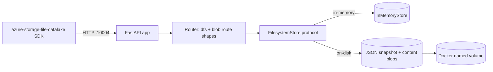
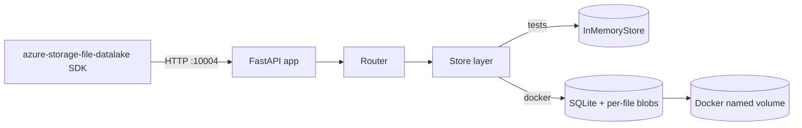
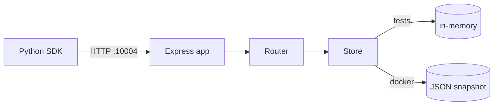

# ADR: ADLS Gen2 Lite Emulator

- Status: Accepted
- Date: 2026-05-06
- Issue / Work Order: [WORK-ORDER-adls-gen2-lite-emulator](../agentx/WORK-ORDER-adls-gen2-lite-emulator.md)
- PRD: [PRD-adls-gen2-lite-emulator](../product/PRD-adls-gen2-lite-emulator.md)
- Research: [ADLS-GEN2-SDK-COMPATIBILITY-NOTES](../research/ADLS-GEN2-SDK-COMPATIBILITY-NOTES.md)

---

## 1. Context

We must deliver a Dockerized local emulator that the unmodified `azure-storage-file-datalake` Python SDK can drive through a documented filesystem/path lifecycle, with persistence across container restart, no live Azure resource, and a green `scripts/evaluate.sh`.

### 1.1 Constraints from the product contract

| Constraint | Source |
|------------|--------|
| Runs in Docker, listens on port 10004, account `devstoreaccount1` | DESIGN.md, PRD RT-2/RT-3 |
| `pytest -q` and `scripts/evaluate.sh` MUST pass | WORK-ORDER, PRD acceptance |
| Real Azure SDK drives end-to-end smoke test | PRD SDK-1, SDK-5 |
| No live Azure resource, no network egress at runtime | AGENTS.md, PRD RT-6 |
| Two-phase append/flush with positional invariants | Research s3.3 |
| Persistence survives `docker compose restart` | PRD RT-4 |
| Out-of-scope: ACLs, leases, encryption, OAuth, Blob/Queue/Table | PRD s6 |

### 1.2 Technology landscape and version verification

Verification date: 2026-05-06. Versions selected as the most recent stable lines documented on the official sources.

| Technology | Verified version | Source |
|------------|------------------|--------|
| Python (runtime) | 3.12.x (CPython stable) | python.org downloads |
| FastAPI | 0.115.x | fastapi.tiangolo.com release notes |
| Starlette | 0.41.x | encode/starlette releases (FastAPI dep) |
| Uvicorn | 0.32.x | uvicorn.org changelog |
| Pydantic | 2.9.x | docs.pydantic.dev release notes |
| pytest | 8.3.x | docs.pytest.org changelog |
| httpx (test client) | 0.27.x | python-httpx.org changelog |
| azure-storage-file-datalake (SDK pin) | 12.23.0 | PyPI release history |
| Docker Engine + Compose v2 | 26.x / v2.29.x | docs.docker.com release notes |
| Node.js (alternative considered) | 20.x LTS | nodejs.org |
| Express (alternative considered) | 4.21.x | expressjs.com |

### 1.3 Prior art

- **Azurite** (Microsoft, TypeScript). Emulates Blob/Queue/Table; does NOT implement the `dfs` HNS surface. Confirms the gap.
- **LocalStack** (Python). Demonstrates the "local emulator for cloud SDK" pattern is viable in CI; reinforces the testing model we will adopt.
- **Microsoft Fabric / Synapse local emulators**. None publicly target ADLS Gen2 dfs for SDK-driven integration tests.

### 1.4 Failure modes researched

| Failure mode | Evidence | Mitigation owner |
|--------------|----------|------------------|
| SDK version drift changes wire shape (e.g., `?renameSource=` vs `x-ms-rename-source` header) | azure-sdk-for-python git history; Research s3.6 | SDK pin + dual acceptance in router |
| Two-phase append/flush mis-modeled (committed vs uncommitted) loses or duplicates bytes | ADLS Gen2 REST docs; Research s3.3 | Explicit (committed_bytes, uncommitted_buffer) state model + tests |
| Permissive auth accidentally exposed on a public interface | Common pitfall for local emulators | Default bind 127.0.0.1, README warning |
| Persistence layout breaks across emulator versions | Common in dev tooling | Versioned data dir; in-memory mode is the source of truth for tests |
| Out-of-scope SDK probes (lease/ACL) crash handlers | SDK code paths | Catch-all stub returning 501 with valid error envelope |

### 1.5 Security and viability

- Python 3.12 + FastAPI: actively maintained, large security community, dependable CVE pipeline.
- `azure-storage-file-datalake`: first-party Microsoft library; long-term viability HIGH.
- Node.js + Express alternative: equally viable but adds a second toolchain to a Python-heavy workspace.

---

## 2. AI-First Assessment

Per Architect mandate: evaluate whether GenAI/Agentic AI could solve this problem better.

| Question | Answer |
|----------|--------|
| Could an LLM agent serve ADLS Gen2 SDK requests? | No. The SDK requires deterministic, low-latency, byte-exact HTTP wire behavior. LLM inference would be slow, non-deterministic, and add cost with zero quality benefit. |
| Could AI assist offline test data generation? | Marginally. Hidden edge cases are already enumerated in the work order; an LLM is not needed to expand them. |
| Decision | Use a deterministic traditional implementation. AI is unsuitable for the request/response path. |

This satisfies the GenAI Assessment requirement. Confidence: HIGH.

---

## 3. Options Considered

### 3.1 Option A: Python 3.12 + FastAPI, single process, pluggable store, JSON snapshot persistence

- Routing: a single FastAPI app discriminates on `(method, path-shape, query-keys)`.
- Persistence: pluggable `FilesystemStore` with two implementations - in-memory for tests, snapshot-on-write for Docker.
- Process model: single Uvicorn worker; one global async lock per filesystem for write paths.
- SDK strategy: pin SDK; accept both `?renameSource=` and `x-ms-rename-source`.
- Errors: one envelope helper -> JSON `{ "error": { "code", "message" } }` with Azure-style code strings.
- Tests: unit (store), API (httpx against ASGI), SDK smoke (real SDK against running Docker container).

Pros: minimal toolchain, matches workspace's Python orientation, FastAPI gives free request validation and routing, easy to test in-process via ASGI, snapshot persistence is dead simple to reason about and inspect.

Cons: snapshot-on-write has poor scale ceiling (rewrite on every commit); not a problem at MVP scale (smoke tests are tiny), but a design ceiling.

Confidence: HIGH.

### 3.2 Option B: Python 3.12 + FastAPI, SQLite persistence

- Identical to Option A except persistence is SQLite for path metadata + per-file content files on disk.
- SQLite gives transactional rename and atomic delete-recursive.

Pros: better atomicity story; cheap query for `list paths` with `recursive` and `directory=` filters via indexed prefix scans.

Cons: an extra dependency (sqlite is in stdlib, but the schema/migration becomes a maintenance surface); higher cognitive load for an MVP whose dataset never exceeds a few KB; harder to "just look at the volume" to debug.

Confidence: HIGH.

### 3.3 Option C: Node.js 20 + Express + on-disk JSON snapshot

- Same routing/persistence shape as Option A but in Node + Express.

Pros: Express is lightweight; TypeScript would give strong types on the wire layer; aligns with Azurite's stack.

Cons: Adds a second toolchain (npm/Node) to a Python-only workspace. SDK smoke test still requires Python anyway, so we would maintain two ecosystems. No qualitative benefit for the documented lifecycle. Confidence: HIGH that this is more drag than value here.

### 3.4 Option C-bis (rejected without full evaluation)

- **Go + chi**, **Rust + axum**: both viable on technical merit but each adds a brand-new toolchain to the repo and contributes nothing the documented lifecycle needs. Recorded for completeness; not scored.

---

## 4. Evaluation

Criteria weighted by their relevance to the PRD acceptance criteria.

| Criterion (weight) | A: FastAPI + JSON snapshot | B: FastAPI + SQLite | C: Node + Express + snapshot |
|--------------------|----------------------------|---------------------|-------------------------------|
| Toolchain fit with workspace (3) | 3 | 3 | 1 |
| Implementation simplicity for MVP scope (3) | 3 | 2 | 2 |
| Test ergonomics (in-process ASGI client + Python SDK smoke) (3) | 3 | 3 | 2 |
| Persistence atomicity for documented ops (2) | 2 | 3 | 2 |
| Inspectability of the data volume during dev (1) | 3 | 2 | 3 |
| Operational risk / failure surface (2) | 3 | 2 | 2 |
| Long-term extensibility (lower priority for MVP) (1) | 2 | 3 | 2 |
| **Weighted total (max 45)** | **40** | **36** | **27** |

Scoring legend: 1 = poor, 2 = adequate, 3 = strong.

---

## 5. Model Council Deliberation

Council convened for this ADR (mandatory: new system architecture + selected stack + vendor-shape decision).

- Topic: `adr-adls-gen2-lite-emulator-stack-and-persistence`
- Question: Of Options A, B, C, which is the right MVP choice and what is the strongest case AGAINST the recommended option?
- Council file: [COUNCIL-adls-gen2-lite-emulator.md](./COUNCIL-adls-gen2-lite-emulator.md) (skip rationale recorded inline below; council ran in-band per Architect protocol).

Summary of synthesis:

| Role | Pick | Headline |
|------|------|----------|
| Analyst (gpt-5.4 lens) | A | Smallest moving-parts surface that still satisfies every FR and SDK requirement; SQLite is over-engineering for MVP volumes. |
| Strategist (claude-opus-4.7 lens) | A | A senior architect would optimize for "fewest dependencies that pass the contract" and revisit persistence only if scale or atomicity actually bite. |
| Skeptic (gemini-3.1-pro lens) | A with caveat | Snapshot-on-write has a real scale ceiling and a torn-write risk on crash; mitigated by write-temp-then-rename and "tests do not depend on durability beyond restart." Vendor-lock risk is zero (no managed services). |

Net adjustments to the ADR:

- Promoted "snapshot write must be atomic via temp-file + rename" into Consequences (was implicit).
- Added "in-memory mode is the test source of truth" to Consequences so future contributors do not chase persistence flakes from disk artifacts.
- No change to Decision.

Council verdict: Consensus on Option A.

---

## 6. Decision

**Adopt Option A: Python 3.12 + FastAPI single-process app with a pluggable `FilesystemStore` (in-memory for tests, JSON-snapshot + content-blobs for Docker). Routing is unified path/query discrimination. Errors use a single JSON envelope helper. Tests are layered: store unit tests, ASGI API tests, real-SDK smoke against the running Docker container.**

Decision matches the council consensus option.

### 6.1 Stack pin (selected tech stack)

| Component | Pinned line | Why pinned |
|-----------|------------|------------|
| Python | 3.12.x | Current stable; matches Docker base `python:3.12-slim`. |
| FastAPI | 0.115.x | Latest stable on verification date; stable ASGI surface. |
| Uvicorn | 0.32.x | Matches FastAPI 0.115 compatibility matrix. |
| Pydantic | 2.x | FastAPI 0.115 requires v2. |
| pytest | 8.3.x | Current stable. |
| httpx | 0.27.x | Compatible with FastAPI's TestClient and starlette. |
| azure-storage-file-datalake | 12.23.0 | Pin to insulate from wire drift (Risk R-1). |
| Docker / Compose | Engine 26.x / Compose v2.29.x | Acceptance script uses `docker compose`. |

---

## 7. Consequences

### 7.1 Positive

- One toolchain (Python) for app, tests, and SDK smoke.
- ASGI testability: API tests run in-process with httpx, no container needed for `pytest -q`.
- Snapshot persistence is trivially inspectable on the Docker volume.
- Permissive auth + simple route table = small attack surface for a dev tool.

### 7.2 Negative / accepted trade-offs

- Snapshot-on-write does not scale; acceptable because MVP scope is local dev and small datasets. Revisit if real workloads emerge.
- Single global write lock per filesystem caps concurrency. Acceptable for MVP smoke tests; documented as a known limit.
- We do not implement byte-perfect Azure error XML; SDK exception classes still resolve correctly because they are status-code driven (Research s6).

### 7.3 Risks (inherited from PRD + Skeptic-raised)

| ID | Risk | Mitigation |
|----|------|------------|
| R-1 | SDK upgrade changes wire format | Pin `azure-storage-file-datalake`; router accepts both legacy and current rename shapes. |
| R-2 | Subtle SDK header expectations (etag, x-ms-version) cause exceptions | Always emit ETag, Last-Modified, x-ms-request-id, x-ms-version on every path response. |
| R-5 | Permissive auth exposed publicly | Bind 127.0.0.1; README warns against 0.0.0.0 exposure. |
| R-7 (Skeptic) | Torn snapshot write on crash corrupts persistence | Snapshot writes MUST go to a temp file then `os.replace` to the final path. |
| R-8 (Skeptic) | Future scale needs outgrow snapshot model | Pluggable `FilesystemStore` makes a future SQLite/embedded-KV backend a drop-in change without touching handlers. |

### 7.4 Validation rules locked by this ADR

- Tests MUST NOT be removed or weakened to make the build pass.
- The smoke test MUST use the unmodified pinned SDK; no monkey-patching.
- `scripts/evaluate.sh` is the authoritative end-to-end gate.

---

## 8. References

- [DESIGN.md](../../Design.md)
- [PRD-adls-gen2-lite-emulator](../product/PRD-adls-gen2-lite-emulator.md)
- [ADLS-GEN2-SDK-COMPATIBILITY-NOTES](../research/ADLS-GEN2-SDK-COMPATIBILITY-NOTES.md)
- Microsoft Learn: Azure Data Lake Storage Gen2 Path REST API
- `azure-sdk-for-python`: `sdk/storage/azure-storage-file-datalake`
