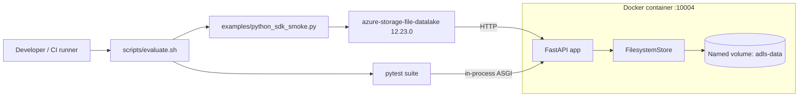
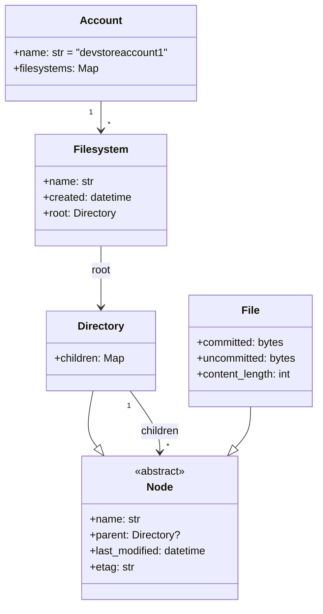

# Tech Spec: ADLS Gen2 Lite Emulator

- Status: Ready for implementation
- Date: 2026-05-06
- ADR: [ADR-adls-gen2-lite-emulator](./ADR-adls-gen2-lite-emulator.md)
- PRD: [PRD-adls-gen2-lite-emulator](../product/PRD-adls-gen2-lite-emulator.md)
- Research: [ADLS-GEN2-SDK-COMPATIBILITY-NOTES](../research/ADLS-GEN2-SDK-COMPATIBILITY-NOTES.md)

This spec defines WHAT must be true and HOW components interact. It does NOT prescribe internal variable names, loop structures, or algorithmic detail; those are Engineer decisions.

---

## 1. Selected Tech Stack

| Layer | Choice | Pinned line |
|-------|--------|-------------|
| Language / runtime | Python | 3.12.x |
| Web framework | FastAPI | 0.115.x |
| ASGI server | Uvicorn | 0.32.x |
| Validation | Pydantic | 2.x |
| Test runner | pytest | 8.3.x |
| Test HTTP client | httpx | 0.27.x |
| Real SDK under test | `azure-storage-file-datalake` | 12.23.0 (pinned) |
| Container runtime | Docker Engine 26.x + Compose v2.29.x | acceptance-script gated |

Verification source and date are recorded in the ADR.

---

## 2. System Context



---

## 3. Module Layout

```
adls-gen2-lite/
  DESIGN.md
  AGENTS.md
  README.md
  pyproject.toml
  Dockerfile
  docker-compose.yml
  src/
    adls_lite/
      app.py                  # FastAPI app factory + middleware wiring
      config.py               # Settings (port, account name, data dir, mode)
      routing/
        account.py            # Account-scope routes (list filesystems, /health)
        filesystem.py         # Filesystem CRUD routes
        path.py               # Path CRUD + append/flush + read/list/rename/delete
        dispatcher.py         # (method, path-shape, query-keys) discriminator
      store/
        base.py               # FilesystemStore protocol + value types
        memory.py             # In-memory implementation
        snapshot.py           # JSON-snapshot + content-blobs implementation
      protocol/
        errors.py             # Error envelope helper + code strings
        headers.py             # ETag / Last-Modified / x-ms-* helpers
        listing.py             # Path listing response shape
      health.py
  tests/
    unit/
      test_store_memory.py
      test_store_snapshot.py
      test_protocol_errors.py
    api/
      test_filesystem_routes.py
      test_path_routes.py
      test_append_flush.py
      test_listing.py
      test_rename.py
      test_delete.py
      test_edge_cases.py
    sdk/
      test_sdk_smoke_inproc.py     # Real SDK against ASGI test transport (optional)
  examples/
    python_sdk_smoke.py
  scripts/
    evaluate.sh
```

Engineer MAY rename internal helpers; the public surface that tests and Docker depend on (module paths used by `pyproject.toml` entry points, `app.py` factory, `examples/python_sdk_smoke.py`, `scripts/evaluate.sh`) MUST be preserved.

---

## 4. Data Model



### 4.1 Invariants

| ID | Invariant |
|----|-----------|
| INV-1 | A `Filesystem` name is unique within an `Account`. |
| INV-2 | Within a `Filesystem`, every path resolves to at most one `Node`. |
| INV-3 | A `File` is a leaf. Creating any child under a `File` MUST fail. |
| INV-4 | `File.content_length` MUST equal `len(committed)` after every flush. |
| INV-5 | `File.uncommitted` MUST be empty after every successful flush. |
| INV-6 | `etag` MUST change on every mutation that affects the node's observable state. |
| INV-7 | Deleting a non-empty `Directory` without `recursive=true` MUST fail. |
| INV-8 | After a successful rename of N from A to B, A MUST resolve to "not found" and B MUST resolve to N. |

---

## 5. Route Mapping

The dispatcher discriminates on `(HTTP method, normalized path shape, key query parameters, key headers)`. The account prefix `/devstoreaccount1` is optional and stripped before dispatch.

### 5.1 Health and account scope

| Method | Path | Query | Behavior |
|--------|------|-------|----------|
| GET | `/health` | - | 200, body `OK`, content-type `text/plain`. |
| GET | `/` | `resource=account` (and/or `comp=list`) | 200, list of filesystems. Body shape: see Section 8. |

### 5.2 Filesystem scope

| Method | Path | Query | Behavior |
|--------|------|-------|----------|
| PUT | `/{filesystem}` | `resource=filesystem` | 201 if created; 409 if exists. |
| DELETE | `/{filesystem}` | (none) | 202 if deleted; 404 if missing. Cascades to all paths. |
| GET | `/{filesystem}` | `resource=filesystem&recursive={bool}[&directory={prefix}]` | 200, paths listing. |

### 5.3 Path scope

| Method | Path | Query | Headers | Behavior |
|--------|------|-------|---------|----------|
| PUT | `/{filesystem}/{path}` | `resource=directory` | - | 201 directory created; 409 if path exists; 404 if parent missing. |
| PUT | `/{filesystem}/{path}` | `resource=file` | optional `If-None-Match: *` | 201 created; 409 if exists and `If-None-Match: *` set; 409 if parent is a file. |
| PATCH | `/{filesystem}/{path}` | `action=append&position={int}` | `Content-Length` MUST equal body size | 202 accepted; 400 on position mismatch. |
| PATCH | `/{filesystem}/{path}` | `action=flush&position={int}` | - | 200 with updated properties; 400 if position mismatches uncommitted tail. |
| GET | `/{filesystem}/{path}` | (none) | optional `Range: bytes=A-B` | 200 full body or 206 partial; 404 if missing. |
| HEAD | `/{filesystem}/{path}` | (none) | - | 200 with properties headers; 404 if missing. |
| PUT | `/{filesystem}/{newPath}` | `mode=rename` | `x-ms-rename-source: /{filesystem}/{oldPath}` (preferred) OR `?renameSource=...` | 201; 404 if source missing; 409 if destination exists. |
| DELETE | `/{filesystem}/{path}` | optional `recursive={bool}` | - | 200/202; 404 if missing; 409 if non-empty directory and not recursive. |

### 5.4 Out-of-scope endpoints

Any request that resolves the dispatcher to "no matching route" or matches a known out-of-scope query (`comp=lease`, `action=getAccessControl`, `action=setAccessControl`, `comp=properties` at service scope, etc.) MUST return:

- HTTP 501
- JSON body `{"error":{"code":"NotImplemented","message":"This endpoint is not implemented in the lite emulator"}}`
- Standard `x-ms-*` headers per Section 9.

### 5.5 Dispatcher decision flow

```mermaid
flowchart TD
  REQ[HTTP request] --> NORM[Strip optional /devstoreaccount1 prefix]
  NORM --> SHAPE{Path shape?}
  SHAPE -->|/health| H[Health handler]
  SHAPE -->|/| ACC[Account handler]
  SHAPE -->|/{fs}| FS{Has resource=filesystem?}
  FS -->|yes + PUT| FSCreate[Create FS]
  FS -->|yes + GET| FSList[List paths]
  FS -->|no + DELETE| FSDel[Delete FS]
  SHAPE -->|/{fs}/{path}| PATH{Method + query}
  PATH -->|PUT resource=directory| DirCreate
  PATH -->|PUT resource=file| FileCreate
  PATH -->|PUT mode=rename| Rename
  PATH -->|PATCH action=append| Append
  PATH -->|PATCH action=flush| Flush
  PATH -->|GET| Read
  PATH -->|HEAD| Head
  PATH -->|DELETE| Delete
  PATH -->|other| NotImpl[501]
```

---

## 6. Append / Flush Behavior

```mermaid
sequenceDiagram
  participant SDK
  participant App as FastAPI
  participant Store

  SDK->>App: PUT /{fs}/{path}?resource=file (If-None-Match:*)
  App->>Store: create_file(fs, path, if_none_match=True)
  Store-->>App: ok (file: committed=b'', uncommitted=b'')
  App-->>SDK: 201 + headers

  loop one or more chunks
    SDK->>App: PATCH ?action=append&position=N (body=chunk)
    App->>Store: append(fs, path, position=N, data=chunk)
    Note over Store: Require N == len(committed) + len(uncommitted)
    Store-->>App: 202 ok or 400 InvalidRange
    App-->>SDK: 202 / 400
  end

  SDK->>App: PATCH ?action=flush&position=M
  App->>Store: flush(fs, path, position=M)
  Note over Store: Require M == len(committed) + len(uncommitted)
  Note over Store: committed = committed + uncommitted; uncommitted = b''; bump etag
  Store-->>App: 200 ok with new content_length=M
  App-->>SDK: 200 + headers

  SDK->>App: GET /{fs}/{path}
  App->>Store: read(fs, path)
  Store-->>App: bytes (length=M)
  App-->>SDK: 200 (or 206 if Range)
```

### 6.1 Required behaviors

| ID | Behavior |
|----|----------|
| AF-1 | `append` with `position` not equal to `len(committed) + len(uncommitted)` -> 400 `InvalidRange`. |
| AF-2 | `flush` with `position` not equal to `len(committed) + len(uncommitted)` -> 400 `InvalidFlushPosition`. |
| AF-3 | A successful `flush` atomically promotes `uncommitted` to the tail of `committed` and clears `uncommitted`. |
| AF-4 | Multiple append/flush cycles on the same file extend the file. Total length after N cycles = sum of all flushed deltas. |
| AF-5 | `Content-Length` header on `append` MUST equal request body size; mismatch -> 400. |
| AF-6 | After flush, HEAD MUST return `Content-Length = committed length` and a fresh `ETag` and `Last-Modified`. |

---

## 7. Rename Behavior

```mermaid
sequenceDiagram
  participant SDK
  participant App
  participant Store
  SDK->>App: PUT /{fs}/{newPath}?mode=rename, x-ms-rename-source: /{fs}/{oldPath}
  App->>App: Parse source from header (preferred) or ?renameSource=
  App->>Store: rename(fs, old=/{oldPath}, new=/{newPath})
  Note over Store: Acquire filesystem write lock
  Note over Store: Validate: source exists, destination missing, dest parent exists and is dir
  Note over Store: Detach source node from old parent; attach under new parent with new name
  Note over Store: Bump etag on moved node
  Store-->>App: 201 ok
  App-->>SDK: 201 + headers
```

### 7.1 Required behaviors

| ID | Behavior |
|----|----------|
| RN-1 | Source MAY be absolute (`/{fs}/{path}`) or root-relative (`/{path}`); both MUST resolve under the same filesystem. |
| RN-2 | Header `x-ms-rename-source` takes precedence over `?renameSource=` if both are present. |
| RN-3 | Renaming a directory atomically moves the entire subtree. |
| RN-4 | Old path MUST resolve to 404 immediately after success (INV-8). |
| RN-5 | Destination already existing -> 409 `PathAlreadyExists`. |
| RN-6 | Destination parent missing or being a file -> 409 `PathConflict`. |
| RN-7 | Rename MUST preserve `committed` bytes exactly. |

---

## 8. Listing Behavior

### 8.1 Filesystem listing (account scope)

Response body (JSON):

| Field | Type | Notes |
|-------|------|-------|
| `filesystems[]` | array | One entry per filesystem |
| `filesystems[].name` | string | Filesystem name |
| `filesystems[].lastModified` | RFC1123 string | Created or last-modified time |
| `filesystems[].etag` | string | Current etag |

### 8.2 Path listing (filesystem scope)

`GET /{filesystem}?resource=filesystem&recursive={bool}[&directory={prefix}]`

| Field | Type | Notes |
|-------|------|-------|
| `paths[]` | array | One entry per matching node, depth-first stable order |
| `paths[].name` | string | Path within filesystem (no leading slash) |
| `paths[].isDirectory` | string `"true"` | Present only for directories |
| `paths[].contentLength` | string (int as string) | Files only |
| `paths[].lastModified` | RFC1123 string | All entries |
| `paths[].etag` | string | All entries |

### 8.3 Required behaviors

| ID | Behavior |
|----|----------|
| LS-1 | `recursive=true` returns the entire subtree under the filter; `recursive=false` returns only direct children. |
| LS-2 | `directory=foo/bar` scopes results to that subtree (inclusive of children, exclusive of `foo/bar` itself). |
| LS-3 | Continuation tokens are NOT required for MVP; the response MUST NOT include `x-ms-continuation` if the entire result fits in one page. |
| LS-4 | Stable ordering: alphabetical by `name` per directory. |

---

## 9. Response Headers and Error Envelope

### 9.1 Standard response headers

Every response (including errors) MUST include:

| Header | Value strategy |
|--------|----------------|
| `x-ms-request-id` | Fresh UUIDv4 per request |
| `x-ms-version` | `2023-11-03` (constant) |
| `Date` | RFC1123 GMT now |

Path responses (PUT/PATCH/HEAD/GET on a file or directory) MUST additionally include:

| Header | Value strategy |
|--------|----------------|
| `ETag` | Opaque string derived from a per-node monotonic counter |
| `Last-Modified` | RFC1123 GMT of the node |
| `x-ms-resource-type` | `file` or `directory` |

GET on a file MUST include `Content-Length` (full or range slice). Range responses MUST include `Content-Range: bytes A-B/TOTAL` with status 206.

### 9.2 Error envelope

All non-2xx responses MUST be JSON with this shape:

| Field | Type | Notes |
|-------|------|-------|
| `error.code` | string | One of the canonical codes in Section 9.3 |
| `error.message` | string | Human-readable description |

`Content-Type: application/json; charset=utf-8`.

### 9.3 Canonical error codes

| HTTP | Code | Trigger |
|------|------|---------|
| 400 | `InvalidRange` | Append/flush position mismatch or malformed range header |
| 400 | `InvalidFlushPosition` | Flush position not equal to current uncommitted tail |
| 400 | `InvalidInput` | Malformed request body or query |
| 404 | `FilesystemNotFound` | Filesystem missing |
| 404 | `PathNotFound` | Path missing |
| 409 | `FilesystemAlreadyExists` | Create-existing filesystem |
| 409 | `PathAlreadyExists` | Create-existing path or `If-None-Match: *` violated |
| 409 | `PathConflict` | Parent is a file or destination parent invalid |
| 409 | `DirectoryNotEmpty` | Delete non-empty dir without `recursive=true` |
| 501 | `NotImplemented` | Out-of-scope endpoint |

The HTTP status code, not the body, is what makes the SDK raise the right exception class. The codes above ensure user-code introspection of `error_code` works as expected.

---

## 10. Persistence Behavior

### 10.1 Storage modes

| Mode | When | Backing |
|------|------|---------|
| In-memory | `pytest`, ASGI tests, `ADLS_LITE_MODE=memory` | Process-local dict tree |
| Snapshot | Docker default, `ADLS_LITE_MODE=snapshot` | JSON metadata + per-file content blobs on a Docker named volume |

### 10.2 On-disk layout (snapshot mode)

```
/var/lib/adls-lite/
  v1/
    metadata.json              # tree structure + node metadata for ALL filesystems
    blobs/
      {uuid}.bin               # raw committed bytes per file, referenced by node id
```

Engineer MAY change file names within `v1/` but MUST keep `v1/` as the schema-version sentinel. Future schema changes go to `v2/` with a migration note in the README.

### 10.3 Required behaviors

| ID | Behavior |
|----|----------|
| PR-1 | Snapshot writes MUST be atomic: write `metadata.json.tmp` then `os.replace` to `metadata.json`. |
| PR-2 | Content blobs MUST be written to a temp filename then `os.replace` to their final path. |
| PR-3 | After `docker compose restart`, all previously flushed files MUST be readable with identical bytes and properties (etag MAY rotate after restart but MUST remain stable thereafter until next mutation). |
| PR-4 | Uncommitted append buffers MAY be lost across restart (matches Azure semantics); the emulator MUST NOT promote uncommitted data on restart. |
| PR-5 | In-memory mode MUST NOT touch disk and MUST NOT load any existing snapshot. |
| PR-6 | The store layer MUST be a single `FilesystemStore` protocol; both implementations satisfy the same contract. Handlers MUST NOT branch on the implementation. |

---

## 11. Concurrency Model

| Rule | Detail |
|------|--------|
| CC-1 | One `asyncio.Lock` per filesystem guards all mutating operations on that filesystem. |
| CC-2 | Read operations MAY proceed without the lock provided they take a consistent snapshot of node references. |
| CC-3 | Rename and recursive delete MUST run under the lock for the entire operation. |
| CC-4 | The dispatcher is single-process; no cross-process coordination is required. |

---

## 12. Configuration

| Setting | Env var | Default | Notes |
|---------|---------|---------|-------|
| Listen port | `ADLS_LITE_PORT` | `10004` | PRD RT-2 |
| Bind address | `ADLS_LITE_HOST` | `0.0.0.0` inside container; Docker maps to `127.0.0.1:10004` on host | PRD R-5 |
| Account name | `ADLS_LITE_ACCOUNT` | `devstoreaccount1` | PRD RT-3 |
| Storage mode | `ADLS_LITE_MODE` | `snapshot` (Docker), `memory` (tests) | Section 10 |
| Data directory | `ADLS_LITE_DATA_DIR` | `/var/lib/adls-lite` | Snapshot mode only |
| Log level | `ADLS_LITE_LOG_LEVEL` | `info` | |

No secret material is required; permissive auth is documented in the README and the ADR.

---

## 13. Docker / Runtime Behavior

### 13.1 Container

| Requirement | Detail |
|-------------|--------|
| Base image | `python:3.12-slim` |
| Exposed port | `10004` |
| Entrypoint | Uvicorn serving the FastAPI app factory |
| Volume mount | Named volume `adls-data` at `/var/lib/adls-lite` |
| Healthcheck | `curl -fsS http://127.0.0.1:10004/health \|\| exit 1` every 5s |

### 13.2 docker-compose.yml requirements

| Requirement | Detail |
|-------------|--------|
| Service name | `adls-lite` |
| Port mapping | `127.0.0.1:10004:10004` (bind to loopback on host) |
| Volume | `adls-data:/var/lib/adls-lite` |
| Restart policy | `unless-stopped` |

### 13.3 Startup contract

| Behavior | Requirement |
|----------|-------------|
| Cold start to healthy `/health` | <= 60 s on a typical dev laptop (matches `evaluate.sh` poll budget) |
| Outbound network | None at runtime (image build MAY install packages from PyPI) |
| Logging | Structured to stdout; one line per request at info level |

---

## 14. SDK Compatibility Rules

| ID | Rule |
|----|------|
| SC-1 | The `azure-storage-file-datalake` version is pinned in both `pyproject.toml` (test extras) and `examples/python_sdk_smoke.py` `requirements`. |
| SC-2 | Any `Authorization` header value is accepted; signature is not validated. |
| SC-3 | The router accepts both `?renameSource=...` and `x-ms-rename-source` header. |
| SC-4 | The router strips an optional leading `/{account}/` prefix before dispatch. |
| SC-5 | A constant `x-ms-version` header is emitted on every response. |
| SC-6 | The smoke test MUST NOT monkey-patch the SDK. |

---

## 15. Test Strategy

| Layer | Scope | Tooling |
|-------|-------|---------|
| Unit | `FilesystemStore` invariants, error envelope helper, header helpers | pytest + in-process |
| API | Each route in Section 5 against the FastAPI app via httpx ASGI transport | pytest + httpx |
| Edge cases | All hidden edge cases enumerated in Section 16 | pytest + httpx |
| SDK smoke (in-proc) | Real SDK driving the lifecycle through ASGI transport (optional, fast) | pytest + httpx ASGI + SDK |
| SDK smoke (container) | Real SDK driving the lifecycle through real HTTP against running container | `examples/python_sdk_smoke.py` |
| End-to-end gate | Build, start, smoke, teardown | `scripts/evaluate.sh` |

Test rules:

- Tests MUST NOT be removed or weakened to make a build pass.
- The `scripts/evaluate.sh` script is the source-of-truth pipeline; CI MAY add jobs around it but MUST NOT replace it.
- The SDK smoke test MUST exercise: create FS -> create dir -> create file -> append (>= 2 chunks) -> flush -> read -> list -> rename -> read renamed -> delete file -> attempt read deleted (expect `ResourceNotFoundError`) -> delete FS.

---

## 16. Hidden Edge Cases (acceptance-blocking)

Each edge case maps to at least one explicit test.

| ID | Edge case | Required outcome |
|----|-----------|------------------|
| EC-1 | Two-phase append with two or more chunks then flush, repeated twice on the same file | Final length and bytes match the concatenation of all flushed chunks |
| EC-2 | Create directory or file under a path whose parent is a file | 409 `PathConflict` |
| EC-3 | Create file with `If-None-Match: *` when the file already exists | 409 `PathAlreadyExists` -> SDK `ResourceExistsError` |
| EC-4 | GET / HEAD on a path that was deleted | 404 `PathNotFound` -> SDK `ResourceNotFoundError` |
| EC-5 | After `docker compose restart`, previously flushed files are readable with identical bytes | Smoke-equivalent test in DevOps validation |
| EC-6 | After rename, GET on old path returns 404 | 404 `PathNotFound` |

---

## 17. Quality Attributes

| Attribute | Target |
|-----------|--------|
| Cold-start to healthy | <= 60 s |
| `pytest -q` wall time on dev laptop | < 30 s |
| Memory ceiling for in-memory mode | <= 256 MB for the smoke-test workload |
| Latency p50 for path operations under smoke test | <= 50 ms in-process; <= 100 ms over loopback HTTP |
| Concurrency | Single client correctness guaranteed; multi-client correctness guaranteed under the per-filesystem lock |

---

## 18. Security Considerations

| Concern | Treatment |
|---------|-----------|
| Permissive auth | Documented; bind to loopback on host; README warns against public exposure |
| Path traversal | All incoming `{path}` values MUST be normalized; `..` segments MUST be rejected with 400 `InvalidInput` |
| Directory traversal in snapshot mode | Content blob filenames MUST be UUIDs the server generates; user-supplied path strings MUST NOT influence on-disk filenames |
| Resource exhaustion | Single-process dev tool; no quota enforcement; document in README |
| Logging | Do not log `Authorization` header values |

---

## 19. Validation Commands

These commands are the exit gate for implementation. All MUST pass on a clean clone.

| Order | Command | Purpose |
|-------|---------|---------|
| 1 | `python -m compileall src tests examples` | Syntax/import sanity |
| 2 | `pytest -q` | Unit + API + edge-case suite |
| 3 | `docker compose build` | Image builds reproducibly |
| 4 | `docker compose up -d` | Container starts |
| 5 | `curl -fsS http://127.0.0.1:10004/health` | Returns `OK` |
| 6 | `python examples/python_sdk_smoke.py` | Real SDK end-to-end |
| 7 | `docker compose down -v` | Clean teardown |
| 8 | `scripts/evaluate.sh` | Authoritative end-to-end gate; MUST exit 0 |

A restart-persistence check (DevOps validation artifact) additionally runs steps 4-6 then `docker compose restart` then re-reads a previously-flushed file.

---

## 20. Out of Scope (re-stated)

Per PRD Section 6 and ADR Section 1.1: no Blob/Queue/Table, no OAuth, no ACLs, no leases, no encryption scopes, no soft delete, no Delta Lake protocol, no multi-account, no geo-replication. Any SDK call that requires these endpoints SHALL be answered with 501 `NotImplemented`.

---

## 21. Engineer Decision Boundary

The Engineer owns:

- Internal naming, function decomposition, and helper structure inside each module
- Choice of synchronous vs asynchronous persistence within the snapshot store, provided PR-1..PR-6 hold
- Logging format details
- Test file naming inside `tests/` (the directory layout is fixed but file names within may shift)
- Pydantic model shapes for internal validation, provided the wire contract in Sections 5, 8, 9 is preserved

The Engineer does NOT change:

- Module layout's public boundaries (Section 3)
- Wire contract (Sections 5, 8, 9)
- Persistence schema-version directory (`v1/`) (Section 10)
- Configuration env-var names (Section 12)
- Docker contract (Section 13)
- SDK compatibility rules (Section 14)
- Validation commands (Section 19)

---

## 22. References

- [ADR-adls-gen2-lite-emulator](./ADR-adls-gen2-lite-emulator.md)
- [PRD-adls-gen2-lite-emulator](../product/PRD-adls-gen2-lite-emulator.md)
- [ADLS-GEN2-SDK-COMPATIBILITY-NOTES](../research/ADLS-GEN2-SDK-COMPATIBILITY-NOTES.md)
- [DESIGN.md](../../Design.md)
- [WORK-ORDER-adls-gen2-lite-emulator](../agentx/WORK-ORDER-adls-gen2-lite-emulator.md)
